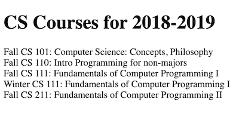

Create a React web app that displays a schedule for courses for a computer science department. The display should be simple. Use basic HTML and CSS.  Using the test data in the JSON below, the page should look like .

```
const schedules = {
    "CS-2018-2019": {
      title: 'CS Courses for 2018-2019',
      courses: {
        "F101": {
          term: "Fall",
          number: "101",
          meets: "MWF 11:00-11:50",
          title: "Computer Science: Concepts, Philosophy, and Connections"
        },
        "F110": {
          term: "Fall",
          number: "110",
          meets: "MWF 10:00-10:50",
          title: "Intro Programming for non-majors"
        },
        "S313": {
          term: "Spring",
          number: "313",
          meets: "TuTh 15:30-16:50",
          title: "Tangible Interaction Design and Learning"
        },
        "S314": {
          term: "Spring",
          number: "314",
          meets: "TuTh 9:30-10:50",
          title: "Tech & Human Interaction"
        }
      }
    }
  };
```
